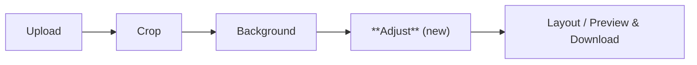
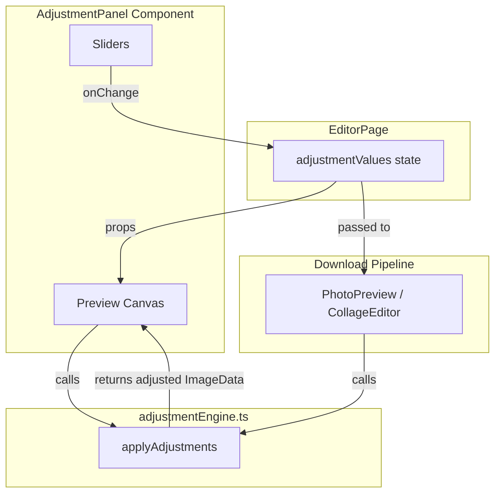

# Design Document: Photo Adjustments

## Overview

This feature adds a photo adjustment step to the EasyPortrait editor workflow, inserted between the Background and Download steps. Users can fine-tune their cropped passport photo using seven sliders (Brightness, Contrast, Saturation, Exposure, Warmth, Sharpness, Face Lighting) with real-time canvas preview. A dedicated pixel-manipulation engine utility (`adjustmentEngine.ts`) applies transformations to `ImageData` and is designed to be pure, testable, and reusable across both the preview and the final full-resolution download pipeline.

The adjustment UI mirrors the existing sidebar-plus-main-area layout used by the crop and background steps: sliders live in the left sidebar, and the preview canvas occupies the right main area. All adjustments are applied at full output resolution before download (single and collage), and a "Reset All" button returns every slider to its neutral midpoint. Each slider is prefixed with a Lucide React icon (Sun, Contrast, Palette, Aperture, Thermometer, Focus, Lightbulb) for a modern, consistent look. The feature is also showcased on the EasyPortrait landing page with an animated before/after card that follows the same visual pattern as the existing hero showcase cards.

## Architecture

The feature integrates into the existing `EditorPage` workflow by adding a new `'adjust'` value to the `EditorStep` union type. The architecture follows the same pattern as the background step: state lives in `EditorPage`, a dedicated UI component renders the controls and preview, and a utility module handles the pixel math.



### Data Flow



### Key Design Decisions

1. **New step in EditorStep union** — Adding `'adjust'` to the existing `EditorStep` type keeps the step machine pattern consistent. The step order becomes `upload → crop → background → adjust → layout/preview`.

2. **Pure pixel engine** — `applyAdjustments(imageData, values)` is a pure function operating on `ImageData`. No canvas creation inside the engine; the caller provides and manages canvases. This makes the engine trivially testable with synthetic pixel arrays.

3. **Debounced preview** — Slider changes are debounced (≤200ms) before triggering a re-render on the preview canvas. The previous frame stays visible during computation to avoid flicker (Requirement 3.4).

4. **Full-resolution at download time** — The preview uses a scaled-down canvas for performance. At download time, the engine runs on the full-resolution canvas (at selected DPI) so the output matches what the user sees but at print quality.

5. **Sharpness via convolution** — Sharpness uses an unsharp-mask kernel applied as a 3×3 convolution. This is the only adjustment that reads neighboring pixels; all others are per-pixel.

6. **Face Lighting via radial gradient mask** — Face Lighting brightens the center of the image using a radial falloff, approximating face position without requiring face detection.


## Components and Interfaces

### 1. `AdjustmentPanel` Component

**File:** `EasyPortrait/src/components/AdjustmentPanel.tsx`

A React component that renders the adjustment UI: a sidebar with sliders and a main-area preview canvas.

```tsx
interface AdjustmentPanelProps {
  imageSrc: string;                // Original source image URL
  cropArea: Area;                  // Crop coordinates from the crop step
  processedImageUrl: string;       // Background-replaced image URL (or '' if none)
  adjustmentValues: AdjustmentValues;
  onAdjustmentChange: (values: AdjustmentValues) => void;
}
```

**Responsibilities:**
- Renders seven labeled `<input type="range">` sliders in the sidebar area, each prefixed with its Lucide React icon component (e.g., `<Sun className="h-4 w-4" />` for Brightness)
- Displays a `<canvas>` preview in the main area showing the adjusted image
- Debounces slider changes and calls `applyAdjustments` from the engine
- Provides a "Reset All" button that resets `adjustmentValues` to `DEFAULT_ADJUSTMENT_VALUES`
- Each slider has an associated `<label>` with `for`/`id` pairing for accessibility
- Displays the current numeric value next to each slider

### 2. `adjustmentEngine.ts` Utility

**File:** `EasyPortrait/src/utils/adjustmentEngine.ts`

A pure utility module with no DOM dependencies beyond `ImageData`.

```tsx
/**
 * Apply all photo adjustments to raw pixel data.
 * Returns a new ImageData with transformations applied.
 * When all values are at neutral midpoints, output is identical to input (identity property).
 */
function applyAdjustments(imageData: ImageData, values: AdjustmentValues): ImageData;

/**
 * Apply adjustments to a canvas element.
 * Creates a new canvas with adjusted pixels. Returns source canvas on error.
 */
function applyAdjustmentsToCanvas(
  sourceCanvas: HTMLCanvasElement,
  values: AdjustmentValues
): HTMLCanvasElement;
```

**Transformation pipeline order:**
1. Brightness (additive RGB shift)
2. Contrast (scale from midpoint 128)
3. Exposure (multiplicative RGB scale)
4. Saturation (blend toward luminance)
5. Warmth (red/blue channel shift)
6. Face Lighting (radial center brightening)
7. Sharpness (3×3 unsharp mask convolution)
8. Clamp all values to [0, 255]

### 3. Updated `EditorPage.tsx`

**Changes:**
- Add `'adjust'` to `EditorStep` union type
- Add `adjustmentValues` state initialized to `DEFAULT_ADJUSTMENT_VALUES`
- Update `stepLabels` and `stepMap` to include "Adjust" between Background and Download
- Update `handleBack` to navigate from `adjust → background` and from `preview → adjust`
- Update the "Next" button on the background step to navigate to `adjust` instead of `preview`/`layout`
- Render `<AdjustmentPanel>` when `step === 'adjust'`
- Pass `adjustmentValues` to `PhotoPreview` and collage generation for full-resolution application

### 4. Updated `PhotoPreview.tsx`

**Changes:**
- Accept new prop `adjustmentValues?: AdjustmentValues`
- After drawing the cropped/processed image onto the download canvas, call `applyAdjustmentsToCanvas` before passing to `onDownload`
- Apply the same adjustment in the preview rendering

### 5. Landing Page Feature Showcase

**File:** `EasyPortrait/src/pages/LandingPage.tsx`

A new hero card (Card 4) is added to the right-column hero showcase area, following the same pattern as the existing three cards (AI Background Removal, Smart Crop, Sheet Sizes). It demonstrates the photo adjustment feature with an interactive before/after slider effect.

**Visual Design:**
- Uses `samplePhoto4` (the "lady with scarf" image from `EasyPortrait/src/resources/Gemini_Generated_Image_n0jv12n0jv12n0jv.jpeg`) as the demo image
- Displays a before/after comparison using a CSS clip-path slider that auto-animates back and forth
- The "before" side shows the original image; the "after" side shows a CSS-filtered version simulating brightness/contrast adjustments (using CSS `filter: brightness(1.15) contrast(1.1)`)
- A vertical divider line with a drag handle icon animates horizontally to reveal the effect
- Below the visual, small pill buttons show the adjustment names (Brightness, Contrast, Saturation) with Lucide icons, auto-cycling the active one
- Footer label: `<Sun /> Photo Adjustments — Fine-Tune Your Look` with a `NEW` badge

**Implementation Details:**
- Add a new `useEffect` with `setInterval` to animate the slider position (0% to 100% and back) over a 3-second cycle
- The before/after effect uses two overlapping `<div>` elements: one with the original image, one with the CSS-filtered image, clipped via `clipPath: inset(0 ${100 - sliderPos}% 0 0)`
- The card follows the same structure as existing cards: outer glow div, white rounded-xl container, visual + buttons row, footer label
- Uses `Sun` icon from lucide-react in the footer label, consistent with the adjustment feature's icon set

**Card Structure (matching existing pattern):**
```tsx
{/* Card 4: Photo Adjustments */}
<div className="relative">
  <div className="absolute inset-0 bg-gradient-to-r from-amber-400 to-orange-500 rounded-xl opacity-15 blur-lg" />
  <div className="relative bg-white rounded-xl shadow-lg px-6 py-5">
    <div className="flex items-center gap-4">
      {/* Before/After slider visual */}
      <div className="relative w-28 h-28 rounded-lg overflow-hidden shadow-inner flex-shrink-0">
        {/* Original image (full) */}
        
        {/* Adjusted image (clipped) */}
        <div className="absolute inset-0" style={{ clipPath: `inset(0 ${100 - adjustSliderPos}% 0 0)` }}>
          
        </div>
        {/* Slider line */}
        <div className="absolute top-0 bottom-0 w-0.5 bg-white shadow-md transition-all duration-100" style={{ left: `${adjustSliderPos}%` }} />
      </div>
      {/* Adjustment name pills */}
      <div className="flex-1 min-w-0">
        <div className="flex flex-wrap gap-1.5">
          {ADJUST_DEMO_ITEMS.map((item, i) => (
            <button key={i} className={`flex items-center gap-1 px-2 py-1 rounded text-[11px] font-medium transition-all ${
              i === activeAdjustIndex ? 'bg-amber-500 text-white shadow-sm' : 'bg-gray-100 text-gray-600 hover:bg-gray-200'
            }`}>
              <item.icon className="h-3 w-3" />
              <span>{item.label}</span>
            </button>
          ))}
        </div>
      </div>
    </div>
    <div className="flex items-center justify-center gap-1.5 mt-3">
      <Sun className="h-3 w-3 text-amber-500" />
      <span className="text-[10px] font-semibold text-amber-500">Photo Adjustments — Fine-Tune Your Look</span>
      <span className="px-1.5 py-0.5 bg-amber-500 text-white text-[8px] font-bold rounded-full">NEW</span>
    </div>
  </div>
</div>
```

**New constants for the demo:**
```tsx
import { Sun, Contrast, Palette } from 'lucide-react';

const ADJUST_DEMO_ITEMS = [
  { icon: Sun, label: 'Brightness' },
  { icon: Contrast, label: 'Contrast' },
  { icon: Palette, label: 'Saturation' },
];
```

**New state and effects:**
```tsx
const [adjustSliderPos, setAdjustSliderPos] = useState(0);
const [activeAdjustIndex, setActiveAdjustIndex] = useState(0);

// Auto-animate before/after slider
useEffect(() => {
  let frame: number;
  let start: number | null = null;
  const duration = 3000; // 3s full cycle
  const animate = (timestamp: number) => {
    if (!start) start = timestamp;
    const elapsed = (timestamp - start) % duration;
    const progress = elapsed / duration;
    // Ping-pong: 0→100→0
    const pos = progress < 0.5 ? progress * 2 * 100 : (1 - (progress - 0.5) * 2) * 100;
    setAdjustSliderPos(pos);
    frame = requestAnimationFrame(animate);
  };
  frame = requestAnimationFrame(animate);
  return () => cancelAnimationFrame(frame);
}, []);

// Auto-cycle adjustment names
useEffect(() => {
  const interval = setInterval(() => {
    setActiveAdjustIndex((prev) => (prev + 1) % ADJUST_DEMO_ITEMS.length);
  }, 2000);
  return () => clearInterval(interval);
}, []);
```

**Home Button Icon Update:**
The existing home button in `LandingPage.tsx` uses a 🏠 emoji. This should be replaced with a Lucide React `Home` icon for consistency with the rest of the icon modernization in this feature:

```tsx
// Before:
<span className="text-xl">🏠</span>

// After:
import { Home } from 'lucide-react';
<Home className="h-5 w-5" />
```

The surrounding `<a>` tag and its Tailwind classes remain unchanged.

**"How It Works" section update:**
The step list in the "How It Works" section should be updated to include the Adjust step:
```tsx
{ step: '1', title: 'Upload', desc: 'Select your photo' },
{ step: '2', title: 'Crop', desc: 'Adjust the frame' },
{ step: '3', title: 'Background', desc: 'AI removes & replaces' },
{ step: '4', title: 'Adjust', desc: 'Fine-tune brightness & more' },
{ step: '5', title: 'Choose Size', desc: 'Pick your country' },
{ step: '6', title: 'Download', desc: 'Get your photo' },
```
The grid changes from `md:grid-cols-5` to `md:grid-cols-6` to accommodate the extra step.

### 7. Cross-App Navigation System

This section covers the shared navigation components that provide consistent tool switching across all WithSwag tools, per the NAVIGATION.md steering document.

#### 7.1 Shared App Registry

**File (React):** `EasyPortrait/src/constants/apps.ts`

```typescript
export interface WithSwagApp {
  name: string;
  path: string;
  icon: string;
  description: string;
}

export const WITHSWAG_APPS: WithSwagApp[] = [
  { name: 'Portrait Photo', path: '/portrait/', icon: 'Camera', description: 'Passport & ID photos' },
  { name: 'SRT Editor', path: '/srt-editor/', icon: 'FileText', description: 'Subtitle file editor' },
];
```

**Inline (SRT Editor):** Defined at the top of `srt-editor/index.html` in a `<script>` block before the app switcher logic:

```javascript
const WITHSWAG_APPS = [
  { name: 'Portrait Photo', path: '/portrait/', icon: 'camera', description: 'Passport & ID photos' },
  { name: 'SRT Editor', path: '/srt-editor/', icon: 'file-text', description: 'Subtitle file editor' },
];
```

#### 7.2 `AppSwitcher` Component (React — EasyPortrait)

**File:** `EasyPortrait/src/components/AppSwitcher.tsx`

A floating button fixed to the top-right corner using the Lucide `LayoutGrid` icon. Clicking it opens a dropdown popover (desktop) or full-width bottom sheet (mobile <768px) listing all tools from `WITHSWAG_APPS`. Closes on outside click or Escape key.

```tsx
interface AppSwitcherProps {}

function AppSwitcher(): JSX.Element;
```

**Responsibilities:**
- Renders a `<button>` with `LayoutGrid` icon (or `X` when open) fixed at `top-4 right-4 z-50`
- On click, toggles a dropdown with a "WithSwag Tools" header and a list of tool links
- Each tool link shows its Lucide icon (mapped via `iconMap`), name, and description
- Desktop (≥768px): absolute dropdown below the button, `w-72`, white rounded-xl with shadow
- Mobile (<768px): fixed bottom sheet overlay with `bg-black/30` backdrop, rounded-t-2xl white panel
- `useEffect` for outside click detection (`mousedown` on document)
- `useEffect` for Escape key detection (`keydown` on document)
- Button has `aria-label="Open app switcher"` and `aria-expanded` toggled with state

**Icon mapping:**
```tsx
import { Camera, FileText } from 'lucide-react';
const iconMap: Record<string, React.ElementType> = { Camera, FileText };
```

#### 7.3 `Breadcrumbs` Component (React — EasyPortrait)

**File:** `EasyPortrait/src/components/Breadcrumbs.tsx`

A simple navigation breadcrumb showing `WithSwag > Tool Name > Current Step`.

```tsx
interface BreadcrumbsProps {
  toolName: string;
  currentStep?: string;
}

function Breadcrumbs({ toolName, currentStep }: BreadcrumbsProps): JSX.Element;
```

**Responsibilities:**
- Renders a `<nav aria-label="Breadcrumb">` with flex layout
- First item: `<a href="/">WithSwag</a>` with hover color transition
- Separator: Lucide `ChevronRight` icon at size 14
- Second item: tool name (linked if `currentStep` is provided, plain text otherwise)
- Optional third item: current step name as plain text
- Uses `text-sm text-gray-500 font-medium` styling

#### 7.4 Integration in EasyPortrait Pages

**`LandingPage.tsx` changes:**
- Import and render `<AppSwitcher />` (fixed position, renders itself)
- Import and render `<Breadcrumbs toolName="Portrait Photo" />` below the header area
- The home button icon replacement (🏠 → Lucide `Home`) is already covered by Requirement 9.7

**`EditorPage.tsx` changes:**
- Import and render `<AppSwitcher />` (fixed position, renders itself)
- Import and render `<Breadcrumbs toolName="Portrait Photo" currentStep={stepLabels[step]} />` where `stepLabels` maps each `EditorStep` to a display name (e.g., `'adjust' → 'Adjust'`)

#### 7.5 SRT Editor Navigation (Static HTML/CSS/JS)

**File:** `srt-editor/index.html`

Three navigation elements are added to the SRT Editor:

**Home Button** — Replaces the existing `🏠` emoji in the `.home-btn` element with an inline SVG of the Lucide `Home` icon. The `<a>` tag, `href="/"`, and existing CSS class remain unchanged. New CSS is added for the Lucide-style home button (`.ws-home-btn`) matching the NAVIGATION.md spec: `position: fixed; top: 16px; left: 16px; z-50`, white/90 backdrop-blur, rounded-lg shadow, hover scale effect.

**App Switcher** — A new `<div class="ws-app-switcher">` is added after the header, containing:
- A `<button>` with the Lucide `LayoutGrid` SVG icon
- A hidden `<div class="ws-app-switcher-dropdown">` populated by JS from `WITHSWAG_APPS`
- CSS for desktop dropdown (absolute, top-right) and mobile bottom sheet (`@media max-width: 767px`)
- JS toggle logic, outside-click close, Escape key close

**Breadcrumbs** — A `<nav class="ws-breadcrumbs" aria-label="Breadcrumb">` is added below the header, containing:
- `<a href="/">WithSwag</a>` link
- Lucide `ChevronRight` inline SVG separator
- `<span>SRT Editor</span>` current page indicator

All CSS follows the WithSwag design system: `#6366f1` primary, Inter font, 8px border-radius, consistent shadows and transitions.

### 6. Updated Collage Generation in `EditorPage.tsx`

**Changes:**
- In `handleGenerateCollage`, after drawing each photo tile, apply adjustments to the tile canvas before compositing onto the collage canvas
- Alternatively, apply adjustments to the source image once at full resolution, then tile the adjusted image


## Data Models

### `AdjustmentValues` Interface

**File:** `EasyPortrait/src/types/index.ts`

```typescript
export interface AdjustmentValues {
  brightness: number;   // Range: -100 to +100, default: 0
  contrast: number;     // Range: -100 to +100, default: 0
  saturation: number;   // Range: -100 to +100, default: 0
  exposure: number;     // Range: -100 to +100, default: 0
  warmth: number;       // Range: -100 to +100, default: 0
  sharpness: number;    // Range: 0 to +100, default: 0
  faceLighting: number; // Range: 0 to +100, default: 0
}
```

### `AdjustmentSliderConfig` Interface

**File:** `EasyPortrait/src/types/index.ts`

```typescript
import { LucideIcon } from 'lucide-react';

export interface AdjustmentSliderConfig {
  key: keyof AdjustmentValues;
  label: string;
  min: number;
  max: number;
  step: number;
  defaultValue: number;
  icon: LucideIcon; // Lucide React icon component
}
```

### Constants

**File:** `EasyPortrait/src/constants/index.ts`

```typescript
import { Sun, Contrast, Palette, Aperture, Thermometer, Focus, Lightbulb } from 'lucide-react';

export const DEFAULT_ADJUSTMENT_VALUES: AdjustmentValues = {
  brightness: 0,
  contrast: 0,
  saturation: 0,
  exposure: 0,
  warmth: 0,
  sharpness: 0,
  faceLighting: 0,
};

export const ADJUSTMENT_SLIDERS: AdjustmentSliderConfig[] = [
  { key: 'brightness',    label: 'Brightness',     min: -100, max: 100, step: 1, defaultValue: 0, icon: Sun },
  { key: 'contrast',      label: 'Contrast',       min: -100, max: 100, step: 1, defaultValue: 0, icon: Contrast },
  { key: 'saturation',    label: 'Saturation',     min: -100, max: 100, step: 1, defaultValue: 0, icon: Palette },
  { key: 'exposure',      label: 'Exposure',       min: -100, max: 100, step: 1, defaultValue: 0, icon: Aperture },
  { key: 'warmth',        label: 'Warmth',         min: -100, max: 100, step: 1, defaultValue: 0, icon: Thermometer },
  { key: 'sharpness',     label: 'Sharpness',      min: 0,    max: 100, step: 1, defaultValue: 0, icon: Focus },
  { key: 'faceLighting',  label: 'Face Lighting',  min: 0,    max: 100, step: 1, defaultValue: 0, icon: Lightbulb },
];

export const ADJUSTMENT_DEBOUNCE_MS = 150; // Debounce delay for slider preview updates
```

### Updated `EditorStep` Type

**File:** `EasyPortrait/src/pages/EditorPage.tsx`

```typescript
// Before:
type EditorStep = 'upload' | 'crop' | 'background' | 'layout' | 'preview';

// After:
type EditorStep = 'upload' | 'crop' | 'background' | 'adjust' | 'layout' | 'preview';
```

### Adjustment Engine Internal Details

**Brightness:** `pixel[c] = pixel[c] + (brightness / 100) * 255`

**Contrast:** Uses the standard contrast formula:
```
factor = (259 * (contrast + 255)) / (255 * (259 - contrast))
pixel[c] = factor * (pixel[c] - 128) + 128
```
where `contrast` is mapped from [-100, 100] to [-255, 255].

**Exposure:** `pixel[c] = pixel[c] * Math.pow(2, exposure / 100)`

**Saturation:** Blend between luminance and original color:
```
lum = 0.2126 * R + 0.7152 * G + 0.0722 * B
pixel[c] = lum + (pixel[c] - lum) * (1 + saturation / 100)
```

**Warmth:** Shift red and blue channels:
```
R = R + warmth * 0.5
B = B - warmth * 0.5
```
where warmth is mapped from [-100, 100] to a suitable pixel range.

**Face Lighting:** Radial gradient mask centered at (width/2, height * 0.4):
```
distance = normalized distance from center (0 at center, 1 at edges)
mask = max(0, 1 - distance)
pixel[c] = pixel[c] + mask * faceLighting * brightnessFactor
```

**Sharpness:** 3×3 unsharp mask convolution kernel:
```
kernel = [
  [ 0, -1,  0],
  [-1,  5, -1],
  [ 0, -1,  0]
]
```
Blended with original based on sharpness amount: `output = original + (sharpened - original) * (sharpness / 100)`

**Clamping:** All output values clamped to `Math.max(0, Math.min(255, value))`.


## Correctness Properties

*A property is a characteristic or behavior that should hold true across all valid executions of a system — essentially, a formal statement about what the system should do. Properties serve as the bridge between human-readable specifications and machine-verifiable correctness guarantees.*

### Property 1: Identity — default adjustments produce identical output

*For any* valid `ImageData` (with pixel values in [0, 255] and length divisible by 4), applying `applyAdjustments` with `DEFAULT_ADJUSTMENT_VALUES` (all zeros) shall produce an `ImageData` whose pixel data is identical to the input.

**Validates: Requirements 5.10**

### Property 2: Output pixel values are always clamped to [0, 255]

*For any* valid `ImageData` and *for any* `AdjustmentValues` (with each parameter within its defined range), every channel value in the output of `applyAdjustments` shall be an integer in the range [0, 255].

**Validates: Requirements 5.9**

### Property 3: Positive brightness increases pixel values

*For any* valid `ImageData` and *for any* positive brightness value (1 to 100, with all other adjustments at default), every pixel channel in the output shall be greater than or equal to the corresponding input channel value.

**Validates: Requirements 5.2**

### Property 4: Positive contrast increases distance from midpoint

*For any* valid `ImageData` and *for any* positive contrast value (1 to 100, with all other adjustments at default), for each pixel channel, the absolute difference `|output[c] - 128|` shall be greater than or equal to `|input[c] - 128|`, except where clamping to [0, 255] applies.

**Validates: Requirements 5.3**

### Property 5: Full negative saturation produces grayscale

*For any* valid `ImageData`, applying `applyAdjustments` with saturation set to -100 (and all other adjustments at default) shall produce pixels where R, G, and B channels are equal (i.e., the image is grayscale).

**Validates: Requirements 5.4**

### Property 6: Positive exposure increases pixel values

*For any* valid `ImageData` and *for any* positive exposure value (1 to 100, with all other adjustments at default), every pixel channel in the output shall be greater than or equal to the corresponding input channel value.

**Validates: Requirements 5.5**

### Property 7: Positive warmth shifts red up and blue down

*For any* valid `ImageData` and *for any* positive warmth value (1 to 100, with all other adjustments at default), the red channel of each output pixel shall be greater than or equal to the input red channel, and the blue channel shall be less than or equal to the input blue channel (before clamping effects).

**Validates: Requirements 5.6**

### Property 8: Face lighting brightens center more than edges

*For any* image of at least 3×3 pixels and *for any* face lighting value > 0 (with all other adjustments at default), the brightness increase of the center pixel shall be greater than or equal to the brightness increase of any corner pixel.

**Validates: Requirements 5.8**

### Property 9: Reset restores default values

*For any* `AdjustmentValues` object (with each parameter randomly set within its valid range), applying the reset operation shall produce an object equal to `DEFAULT_ADJUSTMENT_VALUES`.

**Validates: Requirements 4.2**

### Property 10: Slider change updates only the target parameter

*For any* slider key, *for any* valid value within that slider's range, and *for any* initial `AdjustmentValues`, updating that slider shall change only the corresponding key in the values object, leaving all other keys unchanged.

**Validates: Requirements 2.4**

### Property 11: App registry entries have required fields

*For any* entry in the `WITHSWAG_APPS` array, the entry shall have non-empty `name`, `path`, `icon`, and `description` string properties.

**Validates: Requirements 10.1, 10.2**

### Property 12: AppSwitcher dropdown lists all registered tools

*For any* tool in the `WITHSWAG_APPS` registry, when the AppSwitcher dropdown is open, the dropdown shall contain a link with an `href` matching that tool's `path` and text content containing that tool's `name`.

**Validates: Requirements 10.4, 10.5**

### Property 13: Navigation elements have required accessibility attributes

*For any* navigation button rendered by the AppSwitcher, Home button, or Breadcrumbs components, the element shall have an `aria-label` attribute (for buttons) or be wrapped in a `<nav>` with `aria-label` (for breadcrumbs), and the AppSwitcher trigger button's `aria-expanded` attribute shall match the open/closed state.

**Validates: Requirements 10.11**


## Error Handling

### Adjustment Engine Errors

| Error Condition | Handling | Requirement |
|---|---|---|
| `getContext('2d')` returns `null` on source canvas | Return source canvas unmodified, `console.error` with descriptive message | 8.1 |
| Pixel data is empty or malformed | Return source ImageData unmodified, log warning | 8.1 |
| Individual adjustment computation produces `NaN` or `Infinity` | Clamp to [0, 255] range; `NaN` becomes 0 | 5.9 |

### Preview Canvas Errors

| Error Condition | Handling | Requirement |
|---|---|---|
| `applyAdjustments` throws during preview render | Catch error, display unadjusted image, show non-blocking toast warning: "Adjustments could not be applied" | 8.2 |
| Image source fails to load | Display placeholder with error message, disable sliders | 8.2 |

### Browser Compatibility

| Error Condition | Handling | Requirement |
|---|---|---|
| Browser lacks Canvas 2D `getImageData`/`putImageData` support | Detect on mount via feature check. If unsupported, skip the adjust step entirely — navigate directly from background to preview/download | 8.3 |

### Download Pipeline Errors

| Error Condition | Handling | Requirement |
|---|---|---|
| `applyAdjustmentsToCanvas` fails during download | Fall back to unadjusted canvas for download, show warning toast | 8.1, 8.2 |

### Navigation Errors

| Error Condition | Handling | Requirement |
|---|---|---|
| `WITHSWAG_APPS` registry is empty or undefined | AppSwitcher renders trigger button but shows "No tools available" in dropdown | 10.1, 10.2 |
| App switcher icon fails to resolve from `iconMap` | Render tool link without icon, do not break the dropdown | 10.3 |
| Outside click handler fails to attach | AppSwitcher remains functional via Escape key and explicit close button | 10.6 |

## Testing Strategy

### Property-Based Testing

**Library:** [fast-check](https://github.com/dubzzz/fast-check) — the standard property-based testing library for TypeScript/JavaScript.

**Configuration:**
- Minimum 100 iterations per property test
- Each test tagged with: `Feature: photo-adjustments, Property {number}: {property_text}`
- Tests target the pure `applyAdjustments(imageData, values)` function directly, using synthetic `ImageData` generated by fast-check arbitraries

**Custom Arbitraries:**
- `arbImageData(maxWidth, maxHeight)` — generates random `ImageData` with pixel values in [0, 255]
- `arbAdjustmentValues()` — generates random `AdjustmentValues` with each parameter within its defined range
- `arbSingleAdjustment(key)` — generates values where only one parameter is non-default

**Property tests to implement (one test per property):**

| Test | Property | Description |
|---|---|---|
| Identity | Property 1 | Default values → identical output |
| Clamping invariant | Property 2 | All outputs in [0, 255] for any inputs |
| Brightness monotonicity | Property 3 | Positive brightness → channels ≥ original |
| Contrast expansion | Property 4 | Positive contrast → distance from 128 increases |
| Saturation to grayscale | Property 5 | Saturation -100 → R = G = B |
| Exposure monotonicity | Property 6 | Positive exposure → channels ≥ original |
| Warmth channel shift | Property 7 | Positive warmth → red ≥ original, blue ≤ original |
| Face lighting center bias | Property 8 | Center brightened more than corners |
| Reset to defaults | Property 9 | Any values → reset → DEFAULT_ADJUSTMENT_VALUES |
| Slider isolation | Property 10 | Changing one slider leaves others unchanged |
| Registry completeness | Property 11 | All WITHSWAG_APPS entries have name, path, icon, description |
| Dropdown lists all tools | Property 12 | Open AppSwitcher contains link for every registered tool |
| Accessibility attributes | Property 13 | Navigation elements have required aria attributes |

### Unit Tests

Unit tests complement property tests by covering specific examples, edge cases, and integration points:

- **Edge cases:** All-black image (0,0,0), all-white image (255,255,255), single-pixel image, 1×1 image with face lighting
- **Error handling:** `getContext` returns null → source canvas returned (Req 8.1), canvas API unsupported → adjust step skipped (Req 8.3)
- **Integration:** Navigation flow (background → adjust → preview), progress bar labels include "Adjust", back button from adjust goes to background
- **UI rendering:** 7 sliders rendered with correct labels, each slider has `<label>` with matching `for`/`id`, Reset All button exists and resets values, numeric value displayed next to each slider
- **Landing page showcase:** Card 4 renders in hero section with samplePhoto4 image, three adjustment pill buttons (Brightness, Contrast, Saturation) render with Lucide icons, footer label contains "Photo Adjustments" text and "NEW" badge, "How It Works" section contains 6 steps with "Adjust" at position 4
- **Download pipeline:** Single photo download includes adjustments, collage download applies adjustments per tile, full-resolution output (not preview resolution)
- **Navigation — AppSwitcher:** Renders LayoutGrid icon button at top-right, clicking opens dropdown with all tools listed, clicking outside closes dropdown, pressing Escape closes dropdown, mobile viewport renders bottom sheet instead of dropdown, button toggles aria-expanded
- **Navigation — Breadcrumbs:** Renders nav element with aria-label="Breadcrumb", shows "WithSwag > Portrait Photo" on LandingPage, shows "WithSwag > Portrait Photo > {step}" on EditorPage, ChevronRight separator rendered between items
- **Navigation — SRT Editor:** Home button uses SVG Home icon (not 🏠 emoji) and links to "/", app switcher renders and toggles dropdown, breadcrumb shows "WithSwag > SRT Editor"
- **Navigation — Registry:** WITHSWAG_APPS contains entries for Portrait Photo and SRT Editor, each entry has name, path, icon, and description fields

### Test File Organization

```
EasyPortrait/src/__tests__/
  adjustmentEngine.test.ts        # Property tests + unit tests for the engine
  adjustmentEngine.unit.test.ts   # Unit tests for edge cases and error handling
  AdjustmentPanel.test.tsx        # Component rendering and interaction tests
  editorNavigation.test.tsx       # Step navigation integration tests
  LandingPageShowcase.test.tsx    # Landing page adjustment showcase card tests
  AppSwitcher.test.tsx            # AppSwitcher component tests (dropdown, close, accessibility)
  Breadcrumbs.test.tsx            # Breadcrumbs component tests
  apps.test.ts                    # WITHSWAG_APPS registry property + unit tests
```
